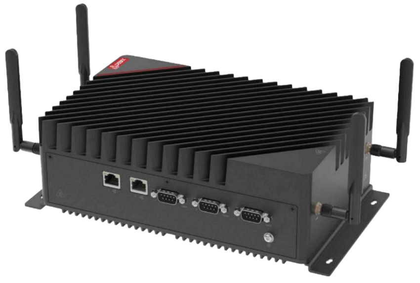
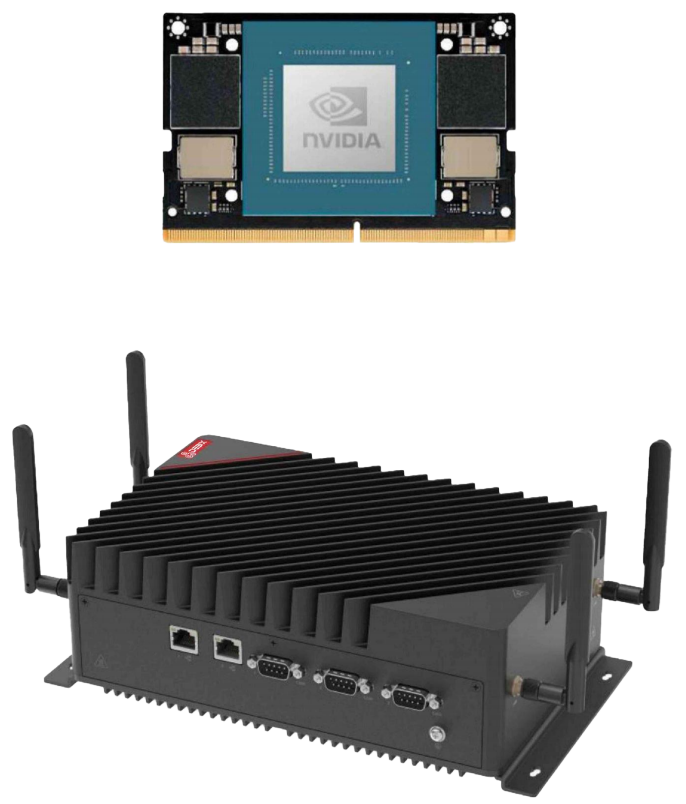

# BPC-EA-500E NVIDIA Jetson Series Edge AI Computing
 

## Overview
The BPC-EA-500E is an industrial-grade embedded system designed for edge AI applications, powered by the NVIDIA Jetson Orin Nano core module from the NVIDIA Jetson Series. Delivering efficient AI processing capabilities, it serves critical domains including Intelligent transportation, vehicle-road collaboration, Logistics 
monitoring, smart security.

## Specification
| System          |                 |
|-----------------|-----------------|
| CPU             | NVIDIA Jetson Orin Nano Module, 6/8-core ARM Cortex-A78AE 64-bit CPU 1.5MB L2 + 4MB L3. The PWR consumption is 7W/15W. |
| Memory          | Onboard 4GB LPDDR5 (8GB optional) |
| Storage         | 1 x M.2 2280 M-Key 1 x 2.5" SATA Driver Bay |
| OS              | Linux OS |
|**Communication**|               
| Gigabit Ethernet | 2 x 1G ETH |
|**Display**|
| Display | 1 x HDMI output |
|**I/O**|  
|  | 1 x CAN (DB9) 2 x USB3.0 1 x USB2.0 Type-C (for update F/W) 2 x RS485/RS232/R422 (DB9) 4 x GMSL (optional) 4 x 1GBE POE (optional, 802.3at) 8 x DIDO (optional, 4 x DI + 4 x DO) 4 x Antenna (optional) |
|**Expansion**|
|  | 1 x M.2 2230 E-Key for WiFi 1 x M.2 2280 M-Key 1 x M.2 3052 B-Key for 4G/5G 1 x 2.5" SATA Drive bay 1 x Nano SIM slot |
|**Power Supply**|
| Power Input | DC 9~36V |
|**Mechanical & Environmental**|
| Enclosure Material | Steel and aluminum alloy |
| Dimension   | 240mm(W) x 155mm(H) x 85mm(D) (±0.5mm) |
| Operating Temp. | -20°C to +70°C (60~70°C slowdown) -40°C to +70°C (optional) |
| Storage Temp. | -40℃ to +70℃ |

## Safety Instructions:
***To aviod malfunction or damage to this product please observe the following:*** 
- Disconnect the device from the DC power supply before cleaning. Use a rag. Do not use liquid 
detergents or spray-on detergents.
- Keep the device away from moisture.
- During installation, put the device on a reliable table. It will be damaged if you drop it.
- Before connecting the power supply, ensure that the voltage is in the required range.
- Put the power cable in place to avoid stepping on it
- If the device is not used for a long time, power it off to avoid damage caused by sudden overvoltage.
- Do not pour liquid into the hold of the enclosure, as this could cause fire or electrocution.
- For safety reasons, the device can only be disassembled by professional personnel.
- Do not place the device outside the specified ambient temperature range. This will damage the machine. It needs to be kept in an environment at controlled temperature.

## Contact Us
- **Headquarters**: DEBIX Technology Inc., 8345 Gold River Ct., Las Vegas, NV 89113, USA  
- **Factory**: 5-6/F., East Zone, Shunheda A2 Building, Liqxiandong Industrial Park, XiLi, Nanshan Dist., Shenzhen, China 
- **Email**: info@debix.io  
- **Website**: [www.debix.io](https://www.debix.io)  
- **Community**: [Discord](https://discord.com/invite/adaHHaDkH2)

